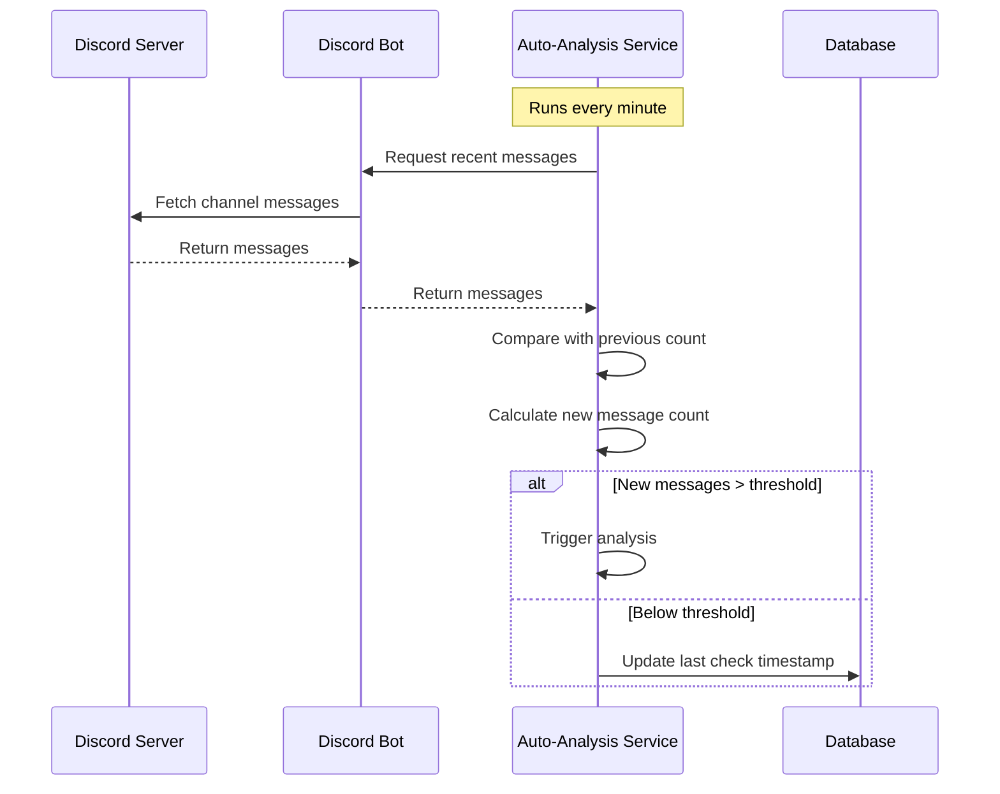
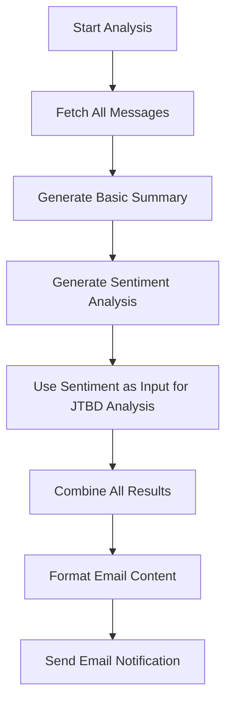

# Discord Digest Auto-Analysis Feature

## Overview

The Auto-Analysis feature is a core component of the Discord Digest application that enables automated monitoring of Discord channels, analysis of new messages when they exceed a configurable threshold, and delivery of email notifications with analysis results to users.

## Architecture

### Components

1. **Auto-Analysis Service**
   - Located in `/server/auto-analysis.ts`
   - Runs on a scheduled interval (every minute)
   - Monitors all accessible Discord channels
   - Tracks message counts and detects new messages
   - Triggers analysis when thresholds are met

2. **Discord Integration**
   - Uses Discord.js to fetch messages from channels
   - Implements `getAllMessages` function to retrieve complete message history
   - Handles authentication and access control for the Discord bot

3. **Analysis Engine**
   - Leverages OpenAI API for generating summaries and insights
   - Custom prompt templates for different analysis types (JTBD, sentiment)
   - Formats analysis results for email delivery

4. **Email Delivery System**
   - Uses Mailjet API for sending emails
   - Implements `sendEmailDirect` utility for backend-triggered emails
   - Formats HTML content for readable analysis results

5. **Frontend Polling Mechanism**
   - Automatically refreshes UI data every 30 seconds
   - Provides visual feedback when checking for updates
   - Ensures real-time display of new messages and analysis results

### Data Flow

```
┌───────────────┐    ┌───────────────┐    ┌───────────────┐    ┌───────────────┐
│  Discord Bot  │───▶│ Auto-Analysis │───▶│ OpenAI API    │───▶│ Email Service │
│  (Messages)   │    │ Service       │    │ (Processing)  │    │ (Delivery)    │
└───────────────┘    └───────────────┘    └───────────────┘    └───────────────┘
                             │                                          │
                             ▼                                          ▼
                     ┌───────────────┐                         ┌───────────────┐
                     │ Database      │◀────────────────────────│ User's Inbox  │
                     │ (Storage)     │                         │               │
                     └───────────────┘                         └───────────────┘
                             │
                             ▼
                     ┌───────────────┐
                     │ React UI      │
                     │ (Frontend)    │
                     └───────────────┘
```

## User Experience Flow

1. **Setup Phase**
   - User connects their Discord bot to desired servers
   - User configures auto-analysis settings:
     - Enable/disable auto-analysis
     - Set message threshold (default: 5 new messages)
     - Configure email notification preferences
     - Provide recipient email address

2. **Monitoring Phase**
   - Discord Digest continuously monitors channel activity (every minute)
   - Message counts for each channel are tracked across check intervals
   - No user action required during this phase

3. **Trigger Phase**
   - When new message count exceeds the user-defined threshold for a channel:
     - Analysis is automatically triggered
     - OpenAI generates insights about the conversation
     - Email is formatted with analysis results

4. **Notification Phase**
   - User receives an email with:
     - Channel information
     - Message count statistics
     - AI-generated summary and insights
     - Time period covered by the analysis

5. **Review Phase**
   - User can view the same analysis results in the Discord Digest UI
   - UI automatically refreshes every 30 seconds to show latest data
   - Analysis history is preserved for future reference

## Configuration Options

| Setting | Description | Default |
|---------|-------------|--------|
| Enable Auto-Analysis | Toggle the entire auto-analysis feature | Off |
| Message Threshold | Number of new messages required to trigger analysis | 5 |
| Check Frequency | How often to check for new messages | 1 minute |
| Email Notifications | Whether to send email notifications | Off |
| Recipient Email | Email address to receive notifications | User's email |

## System Requirements

For the auto-analysis system to function properly end-to-end, the following conditions must be met:

### Required User Settings

1. **`autoAnalysisEnabled`**: Must be set to `true` for the system to monitor channels and detect new messages

2. **`emailNotifications`**: Must be set to `true` for email delivery to occur, even if all other components are functioning correctly

3. **`defaultEmailRecipient`**: Must contain a valid email address where notifications will be sent

4. **`messageThreshold`**: Should be set to an appropriate value (default: 5) that matches the user's notification preferences

### Environment Variables

1. **`MAILJET_API_KEY`** and **`MAILJET_SECRET_KEY`**: Valid Mailjet API credentials are required for email delivery

2. **`SENDER_EMAIL`**: A valid sender email address must be configured

3. **`OPENAI_API_KEY`**: Valid OpenAI API key for generating analysis content

4. **`DISCORD_BOT_TOKEN`**: Valid Discord bot token with permissions to read messages from the configured channels

### Technical Requirements

1. The Discord bot must be added to the server and have read access to the channels being monitored

2. The app must be running and the auto-analysis service must be properly initialized

3. The database must be accessible for storing message counts and analysis results

4. Network connectivity to Discord, OpenAI, and Mailjet APIs must be maintained

## End-to-End Workflow

The following section details the complete workflow of the auto-analysis feature, from message detection to email delivery:

### 1. Message Detection & Tracking



**Implementation Details:**
- The scheduler uses Node's `node-schedule` to run checks every minute
- Message counts are stored in memory in the `lastMessageCounts` object
- Configuration is read from user settings stored in the database
- Detection logic is in the `checkChannelForAutoAnalysis` function

### 2. Multi-Stage Analysis Generation



**Analysis Stages:**

1. **Basic Summary:**
   - Generates concise summary of conversation
   - Identifies key topics as short phrases
   - Uses OpenAI with custom prompt template

2. **Sentiment Analysis:**
   - Analyzes overall sentiment (positive, negative, neutral)
   - Identifies key themes and associated sentiments
   - Includes representative quotes from messages
   - Uses GPT-3.5 Turbo for cost-efficiency

3. **JTBD (Jobs to be Done) Analysis:**
   - Takes sentiment analysis output as input
   - Uncovers explicit and implicit user goals
   - Identifies user motivations, frustrations and tensions
   - Uses GPT-4o for deeper analysis quality

### 3. Email Delivery Process

**Email Content Structure:**
```html
<h1>Discord Channel Auto-Analysis</h1>
<p><strong>Channel:</strong> [Channel Name]</p>
<p><strong>Generated:</strong> [Timestamp]</p>
<p><strong>Messages Analyzed:</strong> [Count]</p>
<p><strong>Active Users:</strong> [Count]</p>

<h2>Recent Activity Summary</h2>
<p>[Summary Text]</p>

<h2>Key Topics</h2>
<p>[Topics List]</p>

<h2>Sentiment Analysis</h2>
<div style="white-space: pre-line;">
  [Sentiment Analysis Content]
</div>

<h2>Jobs To Be Done (JTBD) Analysis</h2>
<div style="white-space: pre-line;">
  [JTBD Analysis Content]
</div>
```

**Delivery Process:**
1. Email content is assembled from all three analysis components
2. User's email address is retrieved from settings
3. Mailjet API is used to deliver the email
4. Status is logged in the console

### 4. Frontend Integration

While the automated email process works independently, the Discord Digest UI also reflects the analysis results:

1. UI polling mechanism refreshes data every 30 seconds
2. The most recent analysis is displayed in the channel view
3. User can manually trigger new analysis from the UI if needed

## Troubleshooting

### Email Notifications Not Being Received

1. **Check User Settings**: The most common cause of email delivery failure is that `emailNotifications` is set to `false` in the user settings.
   - Solution: Access the Settings page and enable Email Notifications
   - Technical check: `curl http://localhost:3001/api/settings` and verify that `emailNotifications` is `true`

2. **Verify Email Configuration**:
   - Ensure a valid email address is set in `defaultEmailRecipient`
   - Check Mailjet API credentials in environment variables
   - Look for any email delivery errors in the application logs

3. **Debug Analysis Generation**:
   - Check the server logs for any errors during OpenAI API calls
   - Verify that the analysis content is being generated successfully
   - Ensure the OpenAI API key is valid and has sufficient quota

### Analysis Not Being Triggered

1. **Check Auto-Analysis Setting**: Ensure `autoAnalysisEnabled` is set to `true`

2. **Verify Message Threshold**: The system only triggers when new messages exceed the threshold
   - If `messageThreshold` is set too high, analysis may never trigger
   - Reset the message counter temporarily for testing: modify `lastMessageCounts[channelId] = 0` in the code

3. **Examine Discord Connectivity**:
   - Verify the bot has proper access to the channels
   - Check for any Discord API rate limits or errors
   - Ensure the channels being monitored are active with new messages

## Implementation Milestones

- [x] Initial auto-analysis service implementation
- [x] Integration with Discord API for message monitoring
- [x] OpenAI integration for message analysis
- [x] Email notification system using Mailjet
- [x] User preferences management for auto-analysis settings
- [x] Automatic UI refresh via polling mechanism
- [x] **MILESTONE ACHIEVED**: Successful end-to-end automation with email delivery

## Future Enhancements

- [ ] User-configurable analysis types (summary, sentiment, topics)
- [ ] Channel-specific thresholds and settings
- [ ] Scheduled digests (daily, weekly) in addition to threshold-based
- [ ] Mobile push notifications
- [ ] Advanced filtering options for message analysis

## Troubleshooting

- **No emails received**: Check email configuration and spam folder
- **Missing messages**: Verify bot has proper channel access permissions
- **Analysis not triggering**: Confirm threshold settings and check server logs
- **UI not updating**: Browser cache issue; try hard refresh or clear cache
